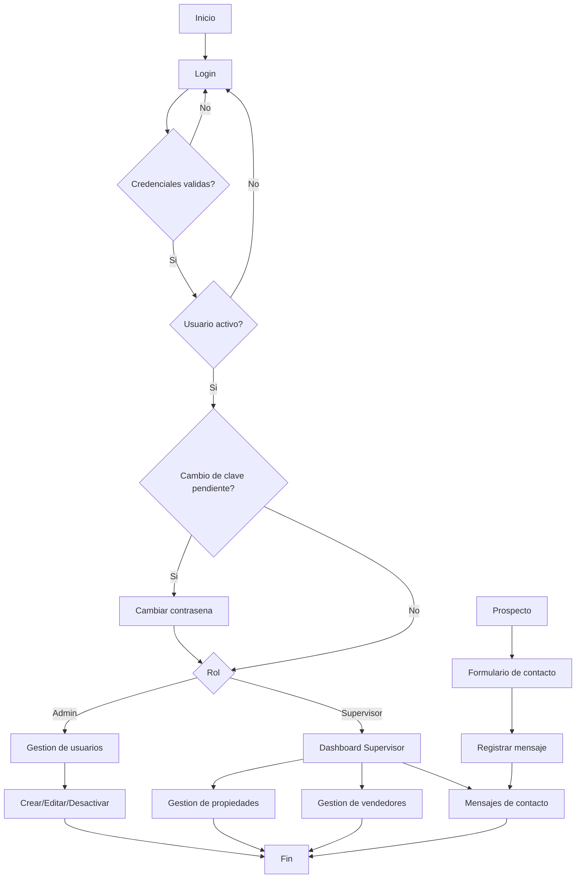

# S6. Actividad practica

## 1. Descripcion del proyecto
Nuestro proyecto es una plataforma web de gestion inmobiliaria llamada "Hogar Ideal Peru". Permite administrar propiedades, vendedores, usuarios y mensajes de contacto.

## 2. Tecnologia y motor de base de datos
- Motor: MySQL
- Lenguaje: SQL
- Acceso: PDO (prepared statements) desde PHP

## 3. Diseno correcto (normalizacion)
- Definimos tablas principales: usuarios, vendedores, propiedades y mensajes.
- La relacion es: propiedades.vendedor_id -> vendedores.id (FK).
- Esta separacion evita redundancia y facilita el mantenimiento.

## 4. Seguridad
- Usamos contrasenas cifradas con bcrypt.
- Implementamos consultas preparadas con PDO para evitar inyeccion SQL.
- Protegimos rutas con middleware de sesion.
- Proponemos usuario de aplicacion con permisos limitados (ver SQL comentado en database/bienes_raices.sql).
- El usuario administrador se crea con install.php (no viene insertado en el SQL).

## 5. Backups
- Incluimos un script de respaldo: scripts/backup_mysql.bat.
- Incluimos un script de restauracion: scripts/restore_mysql.bat.
- Recomendamos backups diarios o semanales segun el volumen.
- Los archivos se guardan en una carpeta backups fuera del repositorio (local o nube).

## 6. Optimizacion
- Agregamos indices en campos de busqueda frecuente:
  - propiedades: vendedor_id, tipo, activo, created_at.
  - mensajes: leido, created_at, email.
- Esto mejora la velocidad de listados y filtros.

## 7. Evidencias sugeridas (capturas)
- Estructura de tablas en MySQL (phpMyAdmin o CLI).
  [CAPTURA 1: tablas y relaciones]
- Consulta de propiedades con JOIN a vendedores.
  [CAPTURA 2: consulta JOIN]
- Login y panel admin funcionando.
  [CAPTURA 3: login o dashboard]
- Ejecucion de backup (archivo .sql generado).
  [CAPTURA 4: backup generado]

## 8. Presentación (orden)
1. Objetivo del proyecto y problema que resuelve.
2. Modelo de datos (tablas y relaciones).
3. Seguridad aplicada.
4. Backups y plan de recuperacion.
5. Optimizacion (indices).
6. Demo breve del sistema.

## 9. Comandos utiles (MySQL)
```sql
-- Ver indices
SHOW INDEX FROM propiedades;

-- Mostrar relaciones
SHOW CREATE TABLE propiedades;
```

## 10. BPM detallado (roles y procesos)

### Roles
- Admin (TI): crea y gestiona usuarios del sistema (supervisores), activa/inactiva cuentas, mantenimiento.
- Supervisor: publica y gestiona propiedades, gestiona vendedores, revisa mensajes de contacto.
- Prospecto: usuario externo que consulta propiedades y envia formulario de contacto.

### Reglas del proceso
- El login valida credenciales y estado (activo/inactivo).
- Solo Admin (TI) puede gestionar usuarios del sistema.
- Solo Supervisor puede crear, editar, publicar o eliminar propiedades y vendedores.
- El contacto de prospecto queda registrado en mensajes para seguimiento.
- TI crea la cuenta del Supervisor con contraseña temporal y se fuerza el cambio al primer ingreso.

### Subprocesos (texto)
1) Login
  - Entrada: email y password.
  - Validacion: credenciales correctas y estado activo.
  - Salida: sesion iniciada y acceso segun rol.

1.1) Cambio de contraseña obligatorio
  - Entrada: contraseña temporal y nueva contraseña.
  - Validacion: longitud minima y confirmacion.
  - Salida: contraseña actualizada y acceso al panel.

2) Gestion de usuarios (Admin TI)
  - Entrada: datos del usuario (nombre, email, rol, estado).
  - Validacion: email unico, rol permitido.
  - Salida: usuario creado/actualizado o desactivado, con cambio de clave pendiente.

3) Publicacion y gestion de propiedades (Supervisor)
  - Entrada: datos de propiedad, imagen, vendedor asignado.
  - Validacion: datos obligatorios y formato de imagen.
  - Salida: propiedad publicada, editada o desactivada.

4) Contacto de prospecto
  - Entrada: nombre, email, mensaje, telefono opcional.
  - Validacion: campos obligatorios y email valido.
  - Salida: mensaje registrado para seguimiento.

### Diagrama BPM (Mermaid)

